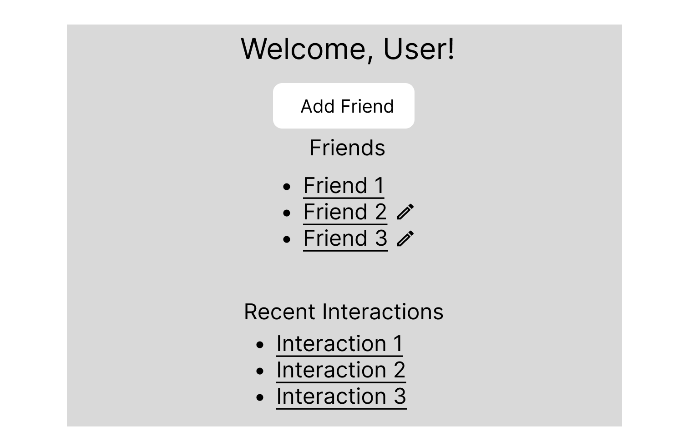
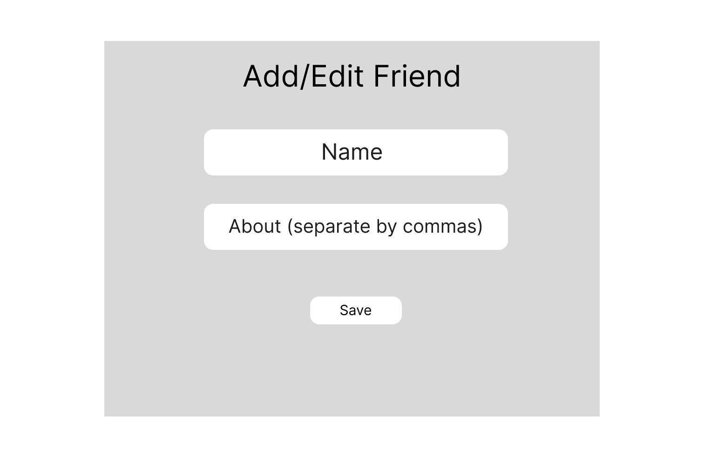
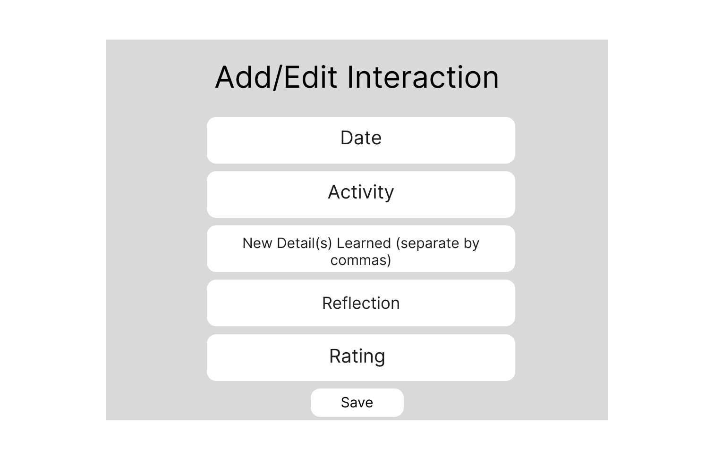
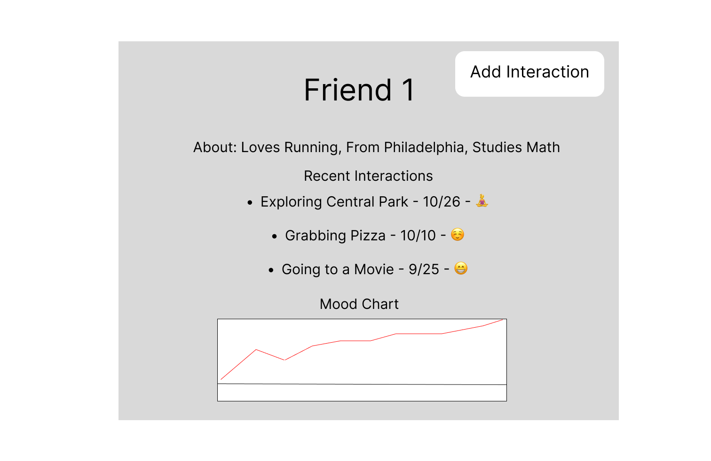
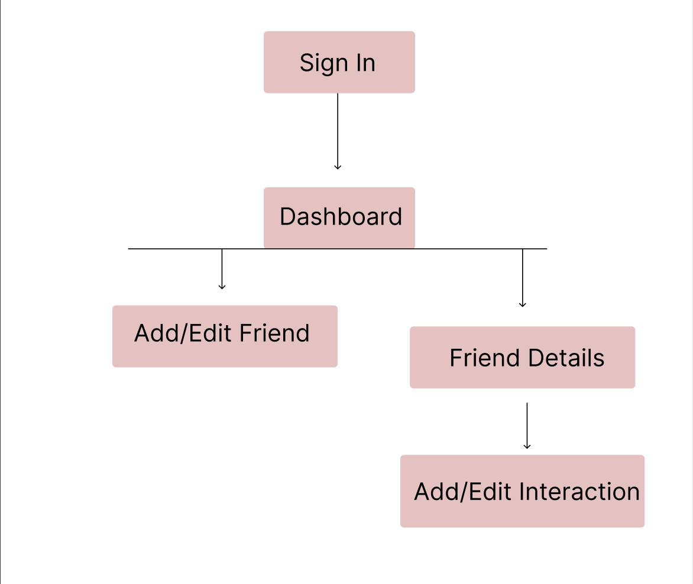

The content below is an example project proposal / requirements document. Replace the text below the lines marked "__TODO__" with details specific to your project. Remove the "TODO" lines.


# VibeCheck 

## Overview

Creating meaningful relationships, especially in a big city like New York, where one can have interactions with several people each day, is difficult. It's hard to remember specific nuances about each friend, and how each hangout made you feel. That's where VibeCheck comes in!

VibeCheck is a web app that will allow users to record interactions with friends, reflect on hangouts, and track important details to assess their relationships. They will be able to sign up and login to view all of their friends or create new ones. For every friend they have, they will be able to add a hangout, new detail they learned about their friend, and record how the interaction made them feel. They will also be able to view past interactions with the friend.

VibeCheck will facilitate the process of making intentional connections by helping users stay mindful of their relationships and the people they choose to spend time with. 

## Data Model


The application will store Users, Friends, and Interactions

* users can have multiple friends (via references)
* each friend can have multiple interactions (by embedding)


An Example User:

```javascript
{
  username: "shubhi_upadhyay",
  email: //email address
  password: // a password hash,
  friends: // an array of references to Friend documents
}
```

An Example Friend with Embedded Interactions:

```javascript
{
  name: "Alex",
  about: [ "Met in College", "Studied Math", "Interested in Running", "Is From Philadelphia" ]
  interactions: [
  {
    date: "2024-10-26",
    activity: "Exploring Central Park",
    newDetail: "Interested in Running",
    reflection: "Enjoyable, had good conversation",
    rating: 5,
    emoji: ☺️

  },
   {
    date: "2024-10-10",
    activity: "Getting Pizza",
    newDetail: "Is From Philadelphia",
    reflection: "Enjoyable, had good conversation",
    rating: 5,
    emoji: 🍕

  },

  ],
  createdAt: // timestamp
}
```


## [Link to Commented First Draft Schema](models) 


The schema definitions can be viewed in [`/final-project/src/models`](/final-project/src/models)

## Wireframes


/dashboard - page for viewing a user's friends / recent interactions in a dashboard format



/friend - page for adding / editing a friend



/friend/interaction-slug - page for adding / editing an interaction



/friend/details-slug - page for viewing a friend's details


## Site map




## User Stories or Use Cases


1. As a user, I want to either log in or create an account on the site to access my recorded friends and interactions
2. As a user, I want to add a new friend to my dashboard so I can record interactions with them
4. As a user, I want to add an interaction corresponding to a friend so I can keep track of the date, activity, and any new details I learned about them
5. As a user, I want to see a list of all of my friends on the dashboard so I can quickly click on and access information about each one
6. As a user, I want to access a friend's profile so I can see all of my past interactions with them along with moods after these interactions.
7. As a user, I want to see a list of details I've learned about each friend so I can hone in on certain relationships at certain times.

## Research Topics


* (2 points) Using a CSS Framework with Customization
   * CSS Frameworks are libraries with pre-defined styles and components, such as buttons and nav bars. These make the life of a developer easier by simplifying the process of creating consistent, cohesive, and responsive web pages. Using a CSS framework thus expedites the process of designing a web page, which allows the developer to focus more on the functionality of the web app rather than its appearance. Personally, I'm leaning more towards Tailwind CSS because it easily integrates with Next.js, which I'm planning on using for my app. So far, it has been pretty easy to use and the docs are very well structured. 
 
* (6 points) Using a Frontend Framework - Next
   * Next is a React-based Javascript library used to build out user interfaces; it facilitates the development process of creating UIs by enabling developers to make reusable components, such as friend details pages and forms for creating and editing friends and interactions. Additionally, the built-in routing system allows me to manage both frontend routes and API endpoints in the same directory, without requiring a separate backend framework like Express.  I'm assigning it 6 points because utilizing a front-end framework is a significant undertaking (although I have previous web dev experience), involving setting up the project structure, creating components, API endpoints and pages, and utilizing the appropriate syntax for connecting to MongoDB.
 
* (3 points) Using server-side Javascript modules - node-cron and nodemailer
  * After doing some researching, I've found a way that I can send automated email reminders to the user if it's been some time since they last interacted with a friend. node-cron is a task scheduler module in Javascript, that can be used to schedule a daily task that searches through the database of friends and finds their most recent interaction with the user. If the date of it is far in the past (say, more than 30 days), then the friend is added to a list. Then, nodemailer, a module that allows Node.js applications to send emails, is configured to send an email to the user with a suggestion for a friend from the list / entire list of friends to catch up with. I gave this three points because it involves multiple steps and two different modules, including setting up the daily task with node-cron, configuring nodemailer to send customized emails, and ensuring the task queries the database accurately and consistently.

 

11 points total out of 10 required points


## [Link to Initial Main Project File] 


[Link to main page - page.js](/final-project/src/app/page.js)

## Annotations / References Used


1. [Next Docs](https://nextjs.org/docs) 
2. [node-cron docs](https://www.npmjs.com/package/node-cron) 
3. [nodemailer inf](https://nodemailer.com/)
4. [Tailwind CSS Docs](https://v2.tailwindcss.com/docs/padding)

